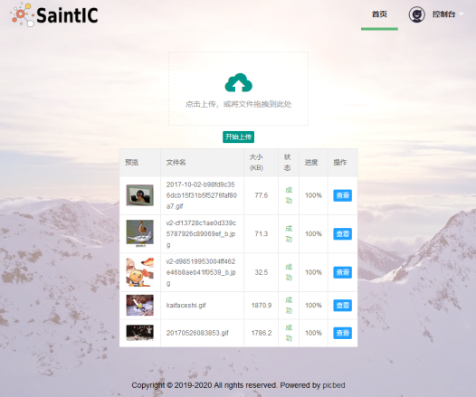
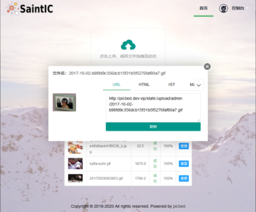
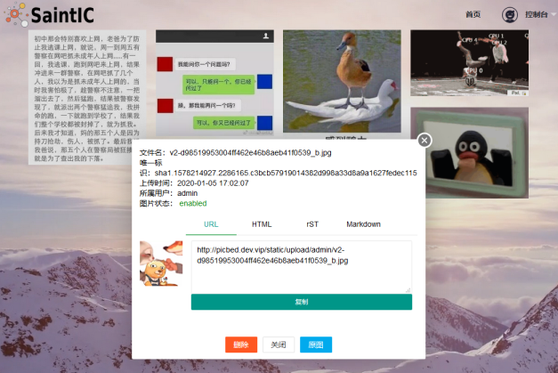

# picbed

基于Flask的Web自建图床，默认存储在本地，内置支持又拍云、七牛云、阿里云OSS、腾讯云COS等对象存储。

[](https://travis-ci.org/staugur/picbed)
[](https://codecov.io/gh/staugur/picbed)

## 手动部署

1. 要求： Python2.7、Python3.5+（含PyPy）和Redis

2. 下载： `git clone https://github.com/staugur/picbed && cd picbed`

3. 依赖： `pip install -r requirements/all.txt` # 也可以参考详情文档如何按需安装依赖包

4. 配置：

    src目录下的config.py即配置文件，它会加载中 `.cfg` 文件读取配置信息，
    无法找到时加载环境变量，最后使用默认值，必需的配置项是picbed_redis_url。

    所以可以把配置项写到 `.bash_profile` 或 `.bashrc` 此类文件中在登录时加载，
    也可以写入到 **.cfg** 文件里，这是推荐的方式，它不会被提交到仓库，
    格式是k=v，每行一条，注意：v是所见即所得！

    比如：`picbed_redis_url=redis://@localhost`

5. 启动： 

    ```
    // 首先创建一个管理员账号 -h/--help显示帮助
    $ flask sa create -u USER -p PASSWORD --isAdmin

    // 开发环境启动
    $ make dev

    // 正式环境，若需前台启动，将start换成run即可；其他支持stop、reload、restart、status
    $ make start 或 sh online_gunicorn.sh start
    ```

6. Nginx:

    ```
    // 默认配置下，picbed启动监听127.0.0.1:9514，nginx配置示例：
    server {
        listen 80;
        server_name picbed.domain.name;
        charset utf-8;
        client_max_body_size 12M;
        location ~ ^\/static\/.*$ {
            root /path/to/picbed/src/;
        }
        location / {
           proxy_pass http://127.0.0.1:9514;
           proxy_set_header Host $host;
           proxy_set_header X-Real-IP $remote_addr;
           proxy_set_header X-Forwarded-Proto $scheme;
           proxy_set_header X-Forwarded-For $proxy_add_x_forwarded_for;
        }
    }
    ```

## 使用Docker部署

- 手动构建镜像

  源码中已经编写了Dockerfile文件，可以藉此构建picbed镜像。

  ```
  $ git clone https://github.com/staugur/picbed && cd picbed
  $ docker build -t picbed .
  ```

- 使用已上传镜像

  已设置CI实现提交代码自动构建并推送到官方Docker仓库中，直接pull即可：

  ```
  $ docker pull staugur/picbed  # 或者加上tag拉取某稳定版本的镜像
  ```

- 启动镜像

  ```
  $ docker run -tdi --name my-picbed --restart=always --net=host \
      -e picbed_redis_url="Your Redis URL" -e other_config_key=value \
      picbed [or: staugur/picbed]
  $ docker exec -i picbed flask sa create -u 管理员账号 -p 密码 --isAdmin
  ```

  使用 *docker run* 启动镜像的命令可以自行修改，picbed所用配置可以使用-e设置
  环境变量，必需项picbed_redis_url，其他请参考文档。

## 文档

详细文档请访问：[Picbed Docs](https://docs.saintic.com/picbed)

## 演示站

http://picbed.demo.saintic.com

测试账号及密码：demo 123456（请勿修改）

对外服务，为防止乱传已关闭匿名上传，随意注册，但不可用于非测试用途，图片保留删除权利！

## 扩展钩子

通过所谓的钩子扩展功能点，目前在图片保存时有一个钩子，可以藉此扩展后端存储。

目前我写的钩子如下：

| 名称 | 作用 | GitHub |
| ---- | ----- | ----- |
| up2upyun | 将图片保存到又拍云USS中 | 已内置 |
| up2qiniu | 将图片保存到七牛云KODO中 | 已内置 |
| up2oss | 将图片保存到阿里云OSS中 | 已内置 |
| up2cos | 将图片保存到腾讯云COS中 | 已内置 |
| up2smms | 将图片保存到sm.ms中 | [staugur/picbed-up2smms](https://github.com/staugur/picbed-up2smms) |
| up2superbed | 将图片保存到聚合图床`superbed.cn` | [staugur/picbed-up2superbed](https://github.com/staugur/picbed-up2superbed) |

更多钩子可以在我的[github](https://github.com/search?q=user%3Astaugur+picbed)搜索。

## 客户端上传

#### - 使用PicGo上传到自定义的picbed图床

[下载PicGo](https://github.com/Molunerfinn/PicGo/releases)并安装，打开主界面，在 **插件设置** 中搜索 **web-uploader** 并安装，然后在 **图床设置-自定义Web图床** 中按照如下方式填写：

```
url: http[s]://你的picbed域名/api/upload

paramName: picbed

jsonPath: src

# 以上是匿名上传，仅在管理员开启匿名时才能上传成功
## 如需登录上传，请使用token(在控制台-个人资料-Token查看)，以下两种任选:
customHeader: {"Authorization": "Token 你的Token值"}
customBody: {"token": "你的Token值", "album: "相册名或留空"}

## 可用LinkToken替换Token(仅用于Header)：
customHeader: {"Authorization": "LinkToken 你的LinkToken值"}
customBody: {"album: "相册名或留空"}
```

设置完之后选择自定义Web图床为默认图床即可。

#### - 使用uPic上传到自定义的picbed图床

[下载uPic](https://github.com/gee1k/uPic)并安装，在 **偏好设置-图床** 中添加 **自定义**，信息如下：

```
API地址：http[s]://你的picbed域名/api/upload
 
请求方式：POST

文件字段名：picbed

其他字段：增加Header字段 或 增加Body字段，任选一种方式：
  - Headers数据
    key: Authorization
    value: Token 你的Token值
    ## 可用LinkToken替换Token(仅用于Header)：
    key: Authorization
    value: LinkToken 你的LinkToken值

  - Body数据
    key: token
    value: 你的Token值
  # 如需设置相册，请增加Body字段，key为album，value即相册名

URL路径：["src"]
```

## 预览图

目前v1版本完成，看几张预览图：








