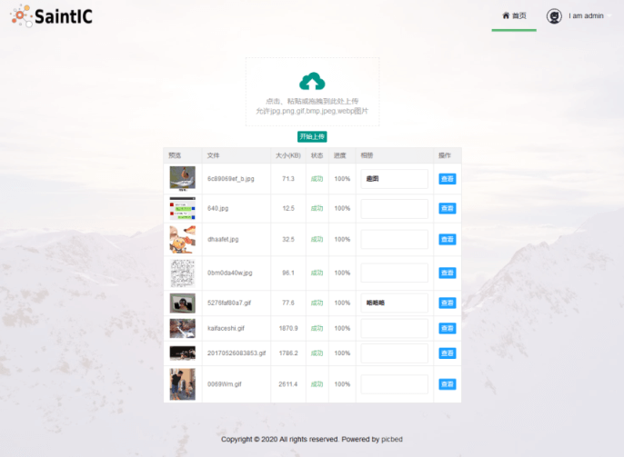
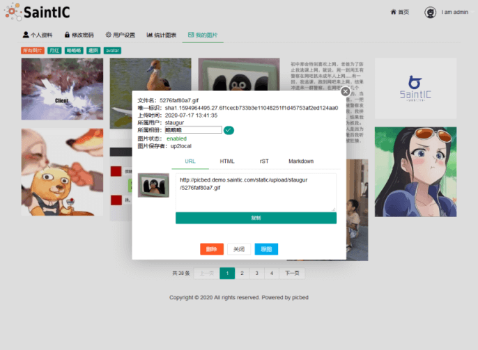
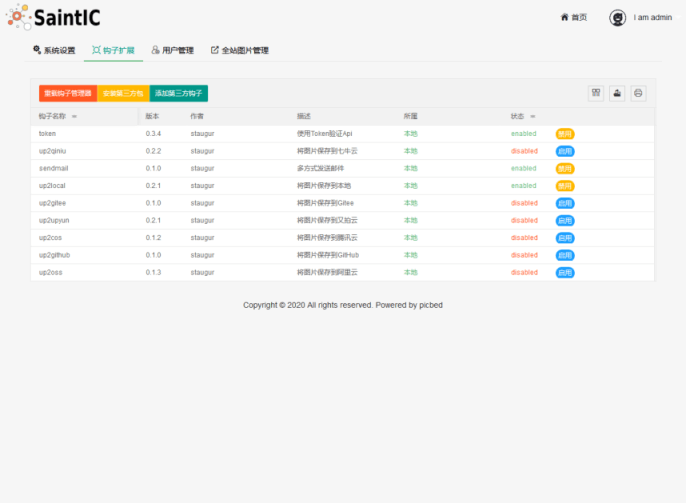

# sapic

即picbed，基于Flask的Web自建图床，
支持存储到本地、又拍云、七牛云、阿里云OSS、腾讯云COS、GitHub、Gitee(码云)等，
支持第三方扩展存储到[AWS S3](https://aws.amazon.com/s3/)、[sm.ms](https://sm.ms/)、[superbed聚合图床](https://www.superbed.cn)等。

[](https://github.com/sapicd/sapic/actions?query=workflow%3A%22build+and+test%22)
[](https://codecov.io/gh/sapicd/sapic)


## 手动部署

1. 要求： Python3.8+ 和 Redis(建议v4.0+)

2. 下载： `git clone https://github.com/sapicd/sapic && cd sapic`

3. 依赖： `pip install -r requirements/all.txt` # 也可以参考详情文档如何按需安装依赖包

4. 配置：

    src目录下的config.py即配置文件，它会加载中 `.cfg` 文件读取配置信息，
    无法找到时加载环境变量，最后使用默认值，**必需设置sapic_redis_url**

    所以可以把配置项写到 `.bash_profile` 或 `.bashrc` 此类文件中在登录时加载，
    也可以写入到 /path/to/sapic/src/ 下的 **.cfg** 文件里，这是推荐的方式，
    它不会被提交到仓库，格式是k=v，每行一条，注意：v是所见即所得！

    比如：`sapic_redis_url=redis://localhost`

5. 启动：

    ```bash
    $ cd /path/to/sapic/src/

    // 首先创建一个管理员账号 -h/--help显示帮助
    $ flask sa create -u USER -p PASSWORD --isAdmin

    // 如果更新了版本，注意执行命令迁移数据，详见文档：部署安装-升级部分
    // flask sa upgrade --help

    // 开发环境启动
    $ make dev

    // 正式环境，若需前台启动，将start换成run即可；其他支持stop、reload、restart、status
    $ make start 或 sh online_gunicorn.sh start
    ```

6. Nginx:

    ```nginx
    // 默认配置下，sapic启动监听127.0.0.1:9514，nginx配置示例：
    server {
        listen 80;
        server_name your-sapic.domain.name;
        charset utf-8;
        client_max_body_size 20M;
        location ~ ^\/static\/.*$ {
            root /path/to/sapic/src/;
        }
        location / {
            proxy_pass http://127.0.0.1:9514;
            proxy_set_header Host $host;
            proxy_set_header X-Real-IP $remote_addr;
            proxy_set_header X-Forwarded-Proto $scheme;
            proxy_set_header X-Forwarded-For $proxy_add_x_forwarded_for;
        }
    }
    ```

## 使用Docker部署

- 手动构建镜像

  源码中已经编写了Dockerfile文件，可以藉此构建镜像。

  ```bash
  git clone https://github.com/sapicd/sapic && cd sapic
  docker build -t stagur/sapic .
  ```

- 使用已上传镜像

  已设置CI实现提交代码自动构建并推送到官方Docker仓库中，直接pull即可（amd/arm）：

  ```bash
  docker pull staugur/sapic  # 或者加上tag拉取某稳定版本的镜像
  ```

- 启动镜像

  ```bash
  $ docker run -d --name sapic --restart=always --net=host \
      -e sapic_redis_url="Your Redis URL" \
      -e 其他配置=值 \
      staugur/sapic
  $ docker exec -i sapic flask sa create -u 管理员账号 -p 密码 --isAdmin
  ```

  使用 *docker run* 启动镜像的命令仅供参考，sapic所用配置可以使用-e设置
  环境变量，必需项sapic_redis_url，其他请参考文档。

  此单一启动镜像方式不包括redis，所以还需要提前准备好redis才行。

------

如果有docker-compose的使用经验，可以使用命令 ``docker-compose up -d``
在后台快速启动项目，它会直接启动一个redis、并构建启动应用，redis开启AOF，
宿主机映射9514端口以供外部访问，且使用数据卷挂载静态资源、挂载上传目录和redis数据目录。

使用前，创建用户：

```bash
cd /path/to/sapic
docker-compose exec webapp flask sa create -u 管理员账号 -p 密码 --isAdmin
```

-------

- 镜像推送到 `Docker Hub`，latest 标签是 master 分支，dev 标签是 dev 分支，其他标签是已发布的版本。

- docker-compose.yml仅为简单定义，可以自行修改，比如加上nginx、redis挂载数据(/data)。

## 文档

### 客户端上传示例

- [使用PicGo上传到自定义的 sapic 图床](https://sapic.rtfd.vip/usage.html#picbed-upload-picgo)

- [使用uPic上传到自定义的 sapic 图床](https://sapic.rtfd.vip/usage.html#picbed-upload-upic)

- [作为自定义命令在使用Typora时上传图片到sapic](https://sapic.rtfd.vip/cli.html#picbed-upload-typora)

- [Windows系统的图片文件添加右键菜单](https://sapic.rtfd.vip/cli.html#picbed-upload-rightmenu-windows)

- [macOS系统的图片文件添加右键菜单](https://sapic.rtfd.vip/cli.html#picbed-upload-rightmenu-macos)

详细文档请访问：[Sapic Docs](https://sapic.rtfd.vip)

## 演示站

http://demo.sapicd.com

测试账号及密码：demo 123456（请勿修改）

对外服务，为防止乱传已关闭匿名上传，随意注册，但不可用于非测试用途，图片保留删除权利！

## 预览图







## 贡献者

感谢以下参与项目的人：

<a href="graphs/contributors"></a>

## Contributing

感谢您的贡献！

关于如何提交issue或pr，请参考 [contributing guidelines](./CONTRIBUTING.md)
